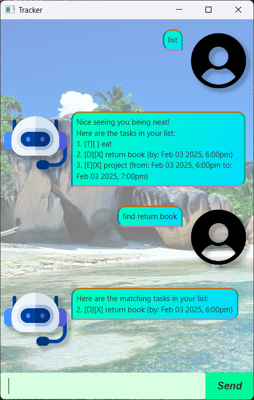

# Tracker User Guide



Tracker is an application to help users keep track of their day-to-day tasks. 

## Adding deadlines

Deadline tasks includes a deadline that the user has to take note of.

Command Usage: `deadline <description> /by <yyyy-MM-dd HHmm>`

Example: `deadline return book /by 2025-02-03 1800`

```
return book (by: Feb 03 2025, 6:00pm)
```

## Adding events

Event tasks includes two dates: from and to, to specify the event duration.

Command Usage: `event <description> /from <start> /to <end>`

Example: `event project /from 2025-02-03 1800 /to 2025-02-03 1900`

```
project (from: Feb 03 2025, 6:00pm to: Feb 03 2025, 7:00pm)
```

## Adding Todos

Todo tasks do not need dates.

Command Usage: `todo <description>`

Example: `todo eat`

```
eat
```

## Mark Tasks

Mark tasks when done.

Command Usage: `mark <index>`

Example: `mark 1`

```
Nice! I've marked this task as done:
[T][X] eat
```

## Unmark Tasks

Unmark tasks.

Command Usage: `unmark <index>`

Example: `unmark 1`

```
OK, I've marked this task as not done yet:
[T][] eat
```

## Delete Tasks

Delete tasks.

Command Usage: `delete <index>`

Example: `delete 1`

```
Noted. I've removed this tasks:
[T][X] eat
Now you have 3 tasks in the list.
```

## Find Tasks

Find tasks with keyword.

Command Usage: `find <index>`

Example: `find return`

```
Here are the matching tasks in your list:
2. [D][X] return book (by: Feb 03 2025, 6:00pm)
```